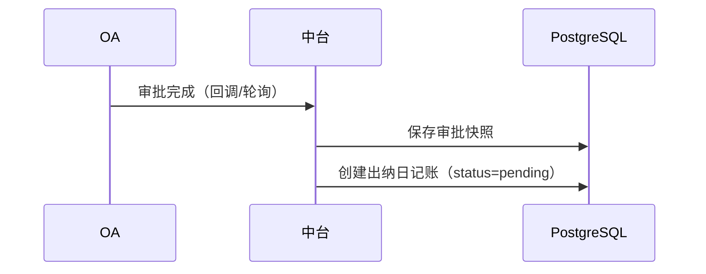
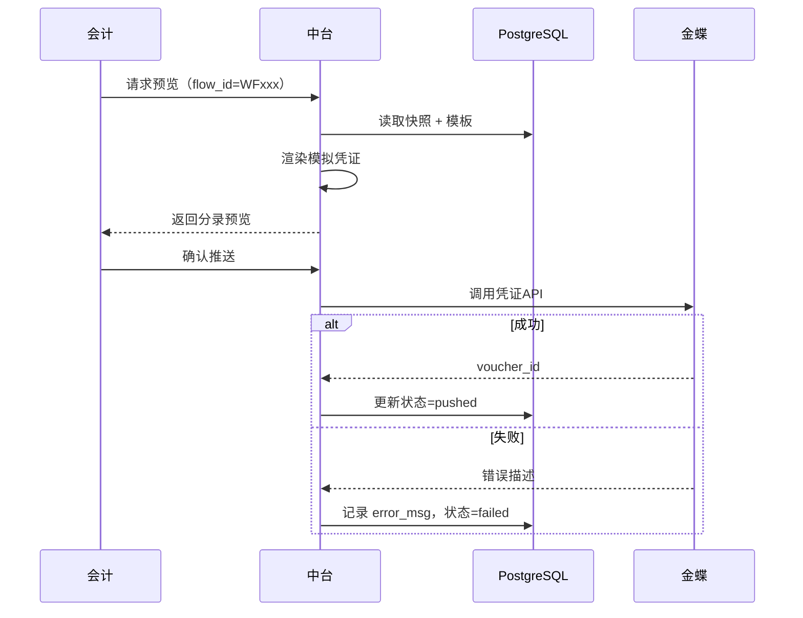

# 财务中台系统架构设计文档  
**版本：1.0**  
**日期：2026年1月21日**  
**适用场景：泛微OA审批流 + 金蝶云星空自动记账集成**

---

## 一、项目背景

当前企业财务流程存在以下痛点：
- 泛微OA负责业务审批，但出纳日记账与凭证生成仍依赖人工操作；
- 金蝶云星空作为核心财务系统，未与业务审批数据打通；
- 凭证录入效率低、易出错，且缺乏审计追溯能力。

为实现 **业财一体化、自动化、可配置化**，特建设独立财务中台，承担 **审批数据采集、日记账管理、凭证规则映射、金蝶对接** 等核心职能，实现“审批完成 → 会计预览 → 一键推送 → 自动记账”闭环。

---

## 二、设计原则

| 原则 | 说明 |
|------|------|
| **解耦** | OA仅管流程，中台管财务逻辑，金蝶只管记账 |
| **可控** | 人工预览 + 手动触发，避免全自动风险 |
| **可配置** | 凭证模板支持图形化配置，无需代码变更 |
| **可追溯** | 所有操作留痕，审批快照永久保存 |
| **安全合规** | 数据加密、权限隔离、符合财务内控要求 |

---

## 三、整体架构

### 3.1 架构图

```mermaid
graph LR
    A[泛微 OA] -->|审批完成回调 / 定时拉取| B[财务中台]
    B -->|调用 WebAPI| C[金蝶云星空]

    subgraph 财务中台（单机部署）
        B1[接入层]
        B2[服务层]
        B3[数据层 - PostgreSQL]
        B4[支撑层]

        B1 --> B2 --> B3
        B4 -.-> B2
    end
```

### 3.2 技术栈

| 组件 | 选型 |
|------|------|
| 后端框架 | Python 3.10 + FastAPI |
| 数据库 | PostgreSQL 14+ |
| 部署方式 | 单机 Docker 容器（或直接运行） |
| 通信协议 | HTTPS + JSON |
| 权限控制 | JWT Token + RBAC |
| 日志 | 文件日志 + 操作审计表 |

---

## 四、核心模块设计

### 4.1 数据接入层

#### 4.1.1 OA 数据采集器
- **功能**：同步已完结的审批单（如报销、付款申请）
- **触发方式**：
  - 优先：泛微 OA 审批结束时 **主动回调** 中台 webhook
  - 备选：中台每5分钟 **定时轮询** OA API
- **同步内容**：仅财务相关字段（见 5.1 节）
- **输出**：保存为 `approval_form_snapshot` 快照

#### 4.1.2 金蝶凭证推送器
- **接口**：调用金蝶云星空 WebAPI  
  `POST /Kingdee.BOS.WebApi.ServicesStub.DynamicFormService.Save`
- **请求体**：按金蝶凭证格式组装 JSON（含科目、金额、辅助核算）
- **重试机制**：失败后最多重试3次，间隔1分钟
- **结果处理**：
  - 成功：记录 `voucher_id`
  - 失败：记录错误码 + 描述（如“科目不存在”）

---

### 4.2 服务层

#### 4.2.1 出纳日记账服务
- 创建/查询日记账（状态：待处理、已推送、失败）
- 关联 `flow_id` 与审批快照

#### 4.2.2 凭证模板引擎（核心）
- **输入**：审批快照 + 业务类型
- **处理**：
  1. 匹配 `voucher_template`（按 `business_type`）
  2. 解析占位符 `${field}` → 替换为实际值
  3. 校验借贷平衡
- **输出**：模拟凭证分录（用于预览）或正式凭证 JSON（用于推送）

#### 4.2.3 用户操作服务
- `/journals`：获取待处理日记账列表
- `/journals/{flow_id}/preview`：预览凭证
- `/journals/{flow_id}/push`：手动推送至金蝶
- `/templates`：模板配置管理（管理员）

---

### 4.3 数据层（PostgreSQL）

#### 表结构

##### 1. `approval_form_snapshot`（审批单快照）
```sql
CREATE TABLE approval_form_snapshot (
    flow_id VARCHAR(50) PRIMARY KEY,
    business_type VARCHAR(50) NOT NULL,
    applicant_id VARCHAR(20),
    applicant_name VARCHAR(50),
    department_code VARCHAR(20),
    total_amount DECIMAL(18,2) NOT NULL,
    approved_at TIMESTAMP,
    form_data_raw TEXT,  -- 原始JSON
    created_at TIMESTAMP DEFAULT CURRENT_TIMESTAMP
);
```

##### 2. `cash_journal`（出纳日记账）
```sql
CREATE TABLE cash_journal (
    id SERIAL PRIMARY KEY,
    flow_id VARCHAR(50) NOT NULL UNIQUE,
    amount DECIMAL(18,2) NOT NULL,
    direction CHAR(1) CHECK (direction IN ('I', 'O')),
    status VARCHAR(20) DEFAULT 'pending',
    voucher_id VARCHAR(50),
    error_msg VARCHAR(500),
    pushed_at TIMESTAMP,
    created_at TIMESTAMP DEFAULT CURRENT_TIMESTAMP,
    FOREIGN KEY (flow_id) REFERENCES approval_form_snapshot(flow_id)
);
```

##### 3. `voucher_template` + `voucher_entry_rule`（凭证模板）
```sql
-- 主表
CREATE TABLE voucher_template (
    template_id VARCHAR(50) PRIMARY KEY,
    template_name VARCHAR(100) NOT NULL,
    business_type VARCHAR(50) NOT NULL,
    description VARCHAR(255),
    active BOOLEAN DEFAULT true
);

-- 分录规则
CREATE TABLE voucher_entry_rule (
    rule_id SERIAL PRIMARY KEY,
    template_id VARCHAR(50) NOT NULL,
    line_no INT NOT NULL,
    dr_cr CHAR(1) CHECK (dr_cr IN ('D', 'C')),
    account_code VARCHAR(50) NOT NULL,
    amount_expr VARCHAR(255) NOT NULL,
    summary_expr VARCHAR(255) NOT NULL,
    aux_items TEXT,  -- JSON
    FOREIGN KEY (template_id) REFERENCES voucher_template(template_id)
);
```

##### 4. `operation_log`（操作审计）
- 记录预览、推送、配置变更等操作

---

## 五、关键数据模型

### 5.1 审批单快照字段定义（示例）

| 字段名 | 来源 | 示例值 |
|--------|------|--------|
| `flow_id` | 泛微流程ID | `WF20260121001` |
| `business_type` | OA流程分类 | `expense_travel` |
| `applicant_id` | 申请人ID | `U1001` |
| `total_amount` | 报销总金额 | `1580.00` |
| `department_code` | 部门编码 | `D005` |

> ✅ 所有字段均可在凭证模板中通过 `${xxx}` 引用。

### 5.2 凭证模板配置样式

```json
{
  "template_id": "EXP_TRAVEL_001",
  "template_name": "员工差旅费报销",
  "business_type": "expense_travel",
  "active": true,
  "entries": [
    {
      "line_no": 1,
      "dr_cr": "D",
      "account_code": "6602.01",
      "amount_expr": "${total_amount}",
      "summary_expr": "报销${applicant_name}差旅费",
      "aux_items": { "employee": "${applicant_id}" }
    },
    {
      "line_no": 2,
      "dr_cr": "C",
      "account_code": "1002.01",
      "amount_expr": "${total_amount}",
      "summary_expr": "支付差旅报销款",
      "aux_items": {}
    }
  ]
}
```

---

## 六、核心业务流程

### 6.1 审批数据同步流程


### 6.2 凭证生成流程


---

## 七、部署与运维

### 7.1 部署架构
- **单机部署**：FastAPI 应用 + PostgreSQL 实例运行在同一服务器
- **依赖**：
  - Python 3.10+
  - PostgreSQL 14+
  - pip install fastapi uvicorn psycopg2-binary pydantic

### 7.2 安全措施
- 所有外部 API 调用使用 HTTPS
- 金蝶 AppSecret、OA Token 加密存储
- 用户操作需登录（JWT）
- 敏感操作（推送、配置）记录操作人/IP/时间

### 7.3 监控与告警
- 推送失败次数 > 5 次/天 → 邮件告警管理员
- 定期校验模板科目有效性（对比金蝶科目表）

---

## 八、实施路线图

| 阶段 | 工作内容 | 周期 |
|------|--------|------|
| Phase 1 | 搭建基础框架，实现1种报销模板，MVP验证 | 2周 |
| Phase 2 | 支持多业务类型，完善辅助核算，增加审计日志 | 2周 |
| Phase 3 | 开发管理后台（模板配置、失败重试） | 1周 |
| Phase 4 | UAT测试 + 上线 | 1周 |

---

## 九、附录

### 9.1 金蝶凭证 API 关键字段映射
| 中台字段 | 金蝶字段 |
|--------|--------|
| `account_code` | `FACCOUNTID.FNumber` |
| `amount` (借) | `FDEBIT` |
| `amount` (贷) | `FCREDIT` |
| `summary_expr` | `FEXPLANATION` |
| `aux_items.employee` | `FDETAILS.FEMPLOYEEID.FNumber` |

### 9.2 扩展建议
- 后续可增加 **条件分录**（如金额>1万走不同科目）
- 支持 **批量推送**
- 对接 **电子档案系统**，自动归档凭证附件

---

**文档结束**  
> 本方案确保财务中台独立、可控、可扩展，完全满足“从OA审批到金蝶自动记账”的核心需求，同时符合企业财务内控与审计要求。